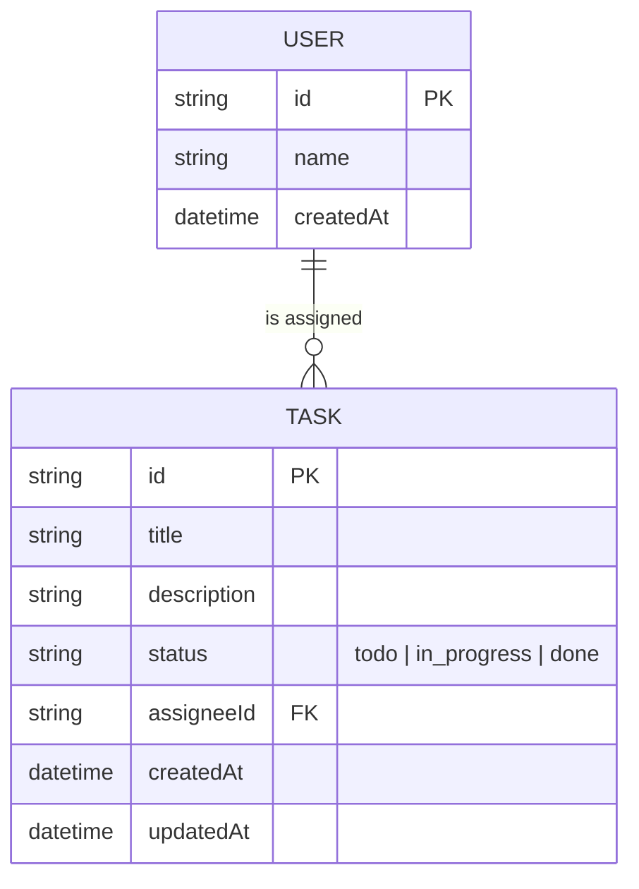

# Team Task Board

A small full-stack task-tracking app built with **NestJS + Prisma** (backend) and
**React + Redux Toolkit + MUI** (frontend).

> Total time spent: ~4 hours

## Stack

- **Backend**: NestJS, Prisma ORM (SQLite), class-validator
- **Frontend**: React 19, Redux Toolkit (RTK Query), MUI

## Project structure

```
team-task-board/
  backend/    NestJS + Prisma REST API
  frontend/   React + Redux + MUI SPA
```

## Data model & ER diagram

`Task` belongs to a `User` (the assignee) — a 1:many relationship. A user can be
assigned many tasks; a task has at most one assignee.



`assigneeId` is nullable, so a task can be created unassigned. Deleting a task
(or leaving it unassigned) doesn't require touching `User`, keeping the model
simple — `User` here exists only as a lightweight "assignee" entity since the
brief said no auth was needed.

## Running the project

Requires Node.js 22+ and npm.

### 1. Backend

```bash
cd backend
npm install
npx prisma migrate deploy   # creates dev.db and applies the schema
npm run seed                # seeds 3 sample users (Alice, Bob, Charlie)
npm run start:dev           # listens on PORT env var, defaults to 3000
```

The frontend's `.env` (see below) points at `http://localhost:3333` because
port 3000 was already taken by another process in my dev environment, so I
ran the backend with `PORT=3333 npm run start:dev`. Use whichever port is
free on your machine, just keep `backend`'s `PORT` and frontend's
`VITE_API_URL` in sync.

Database: SQLite file at `backend/dev.db`, managed via Prisma migrations in
`backend/prisma/migrations`.

### 2. Frontend

```bash
cd frontend
npm install
npm run dev                 # http://localhost:5173
```

`frontend/.env` contains `VITE_API_URL`, pointing at the backend
(defaults to `http://localhost:3333` — adjust if you changed the backend port).

### Tests

```bash
cd backend
npm run test        # unit tests (TasksService)
npm run test:e2e    # e2e tests against a real SQLite test DB (tasks.e2e-spec.ts)
```

## API

| Method | Path                 | Description                              |
|--------|----------------------|-------------------------------------------|
| GET    | `/users`             | List users (for assignee dropdown)        |
| GET    | `/tasks`             | List tasks, filter by `?status=&assigneeId=` |
| POST   | `/tasks`             | Create a task (`title` required)          |
| PATCH  | `/tasks/:id/status`  | Update a task's status                    |
| DELETE | `/tasks/:id`         | Delete a task                             |

## Decisions & Tradeoffs

I prioritized getting a complete, working vertical slice (real DB, validated
API, tests, working UI) over polish or extra features. SQLite was chosen over
Postgres purely for zero-setup local running — Prisma's schema/migrations
would work identically against Postgres by swapping the datasource. I kept
`User` intentionally minimal (just a name) since auth was explicitly out of
scope; a real app would merge this with an authenticated user entity. Status
updates use a `PATCH /tasks/:id/status` endpoint rather than a generic
`PATCH /tasks/:id`, since the brief only calls for status transitions — a
fuller edit-task feature was left out to stay in scope. On the frontend I used
RTK Query (part of Redux Toolkit) instead of hand-rolled thunks/slices for
server state, since it removes a lot of boilerplate for caching/invalidation
while still exercising real Redux Toolkit usage; a separate slice
(`taskFiltersSlice`) holds the local UI filter state. The board groups tasks
into three columns (todo/in_progress/done) with a per-card status dropdown
rather than drag-and-drop, since drag-and-drop adds meaningful complexity for
marginal UX gain within the timebox. With more time I'd add: assignee/task
edit forms, optimistic updates in RTK Query, a "Postgres in Docker" option in
the README, and toast notifications for failed API calls instead of silent
console errors.
